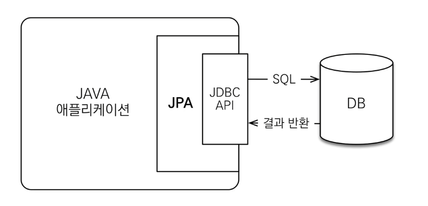

# 섹션 1. JPA 소개

## JPA
- Java Persistence API
- 자바 진영의 ORM 기술 표준

### ORM?
- Object-relational mapping(객체 관계 매핑)
- 객체는 객체 대로 db는 db 대로 설계
- orm 프레임워크가 중간에서 매핑



> JPA는 애플리케이션과 JDBC 사이에서 동작

* **JPA는 인터페이스의 모음**

### JPA를 사용해야 하는 이유
- SQL 중심 개발에서 객체 중심 개발
- 생산성
- 유지 보수
- 패러다임의 불일치 해결
- 성능
- 데이터 접근 추상화와 벤더 독립성
- 표준

#### 생산성 - CRUD
* 저장 : jpa.persist(member)
* 조회 : Member member = jpa.find(memberId);
* 수정 : member.setName("변경할 이름")
* 삭제 : jpa.remove(member)

#### 유지보수
* 기존 : 필드 변경 시 모든 sql 수정 -> JPA : 필드 변경 시 나머지 sql은 JPA가 처리해준다.

#### 상속 가능 , 연관관계, 객체 그래프 탐색 -> 신뢰 할 수 있는 엔티티, 계층

#### 성능 최적화 기능
* 1차 캐시와 동일성(identity) 보장
  * JPA는 같은 트랜잭션 안에서는 같은 엔티티를 반환 - 약간의 조희 성능 향상
* 트랜잭션을 지원하는 쓰기 지연
  * 트랜잭션을 커밋 할 때까지 INSERT SQL을 모음
    * JDBC BATCH SQL 기능을 사용해서 한번에 SQL 전송
  * UPDATE, DELETE로 인한 로우(ROW)락 시간 최소화
    * 트랜잭션 커밋 시 UPDATE, DELETE SQL 실행하고, 바로 커밋
* 지연 로딩
  * 지연 로딩 : 객체가 실제 사용될 때 로딩
  * 즉시 로딩 : JOIN SQL로 한번에 연관된 객체까지 미리 조회


> ORM은 객체와 RDB 두 기둥 위에 있는 기술

----------------------
# 섹션 2. JPA 시작하기

* JPA는 항상 트랜잭션 안에서 실행되어야 한다.

* 엔티티 매니저 팩토리는 하나만 생성해서 애플리케이션 전체에서 공유

* 엔티티 매니저는 쓰레드 간 공유X(사용하고 버려야 한다.)

* JPA의 모든 데이터 변경은 트랜잭션 안에서 실행

#### JPQL

* JPA를 사용하면 엔티티 객체를 중심으로 개발

* 문제는 검색 쿼리

* 검색을 할 때도 테이블X 엔티티 객체를 대상으로 검색

* 모든 db 데이터를 객체로 변환해서 검색은 불가능

* 애플리케이션이 필요한 데이터만 db에서 불러오려면 결국 검색 조건이 포함된 sql이 필요

 > JPA는 SQL을 추상화한 JPQL이라는 객체 지향 쿼리 언어 제공

JPQL - 엔티티 객체를 대상으로 쿼리

SQL - 데이터베이스 테이블을 대상으로 쿼리.

------

# 3. 영속성 관리

* 영속성 컨텍스트(PersistenceContext) : 엔티티를 영구 저장하는 환경

  * EntityManager.persist(entity) : 사실 DB가 아니라 영속성 컨텍스트에 저장한다는 뜻
  * 엔티티 매니저를 통해서 영속성 컨텍스트에 접근

* 엔티티 생명주기
  * 비영속 : 컨텍스트와 전혀 `관계없는 새로운` 상태
  * 영속 : `컨텍스트에 관리`되는 상태
  * 준영속 : 저장되었다 `분리`된 상태
  * 삭제 : `삭제`된 상태


```java
//객체를 생성한 상태(비영속)
Member member = new Member();
member.setId("member1");
////

EntityManager em = emf.createEntityManager();
em.getTransation().begin();

//객체를 저장한 상태(영속)   ->  영속성 컨텍스트에 저장되었을 뿐 DB에 저장된게 아님
em.persist(member);
//

//컨텍스트에서 분리
em.detach(member);

//객체를 삭제
em.remove(member);
```

### 영속성 컨택스트의 이점

* 1차 캐시

* 동일성 보장

* 트랜잭션을 지원하는 쓰기 지연
    
    * 배치 기능이 가능

* 변경 감지(더티 체킹)
    
    * set함수로 값 변경 시 데이터 Update 가능

    * JPA는 commit 시점에 flush가 발생하면서 엔티티와 스냅샷(가져온 시점의 값)을 비교 후 update 쿼리를 쓰기 지연 sql 저장소에 보냄


* 지연 로딩

### 플러시
  * 영속성 컨텍스트의 변경 내용을 데이터베이스에 반영

  * 기능

    * 변경 감지

    * 수정된 엔티티 쓰기 지연 SQL 저장소 등록

    * 쓰기 지연 SQL 저장소의 쿼리를 데이터베이스에 전송 (등록, 수정, 삭제)