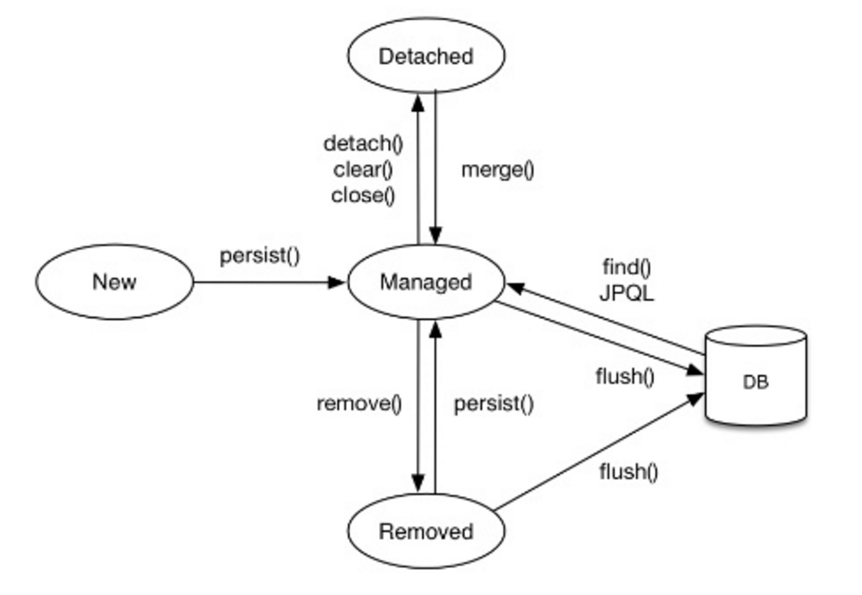

# 섹션 1. JPA 소개

## JPA
- Java Persistence API
- 자바 진영의 ORM 기술 표준

### ORM?
- Object-relational mapping(객체 관계 매핑)
- 객체는 객체 대로 db는 db 대로 설계
- orm 프레임워크가 중간에서 매핑


> JPA는 애플리케이션과 JDBC 사이에서 동작

* **JPA는 인터페이스의 모음**

### JPA를 사용해야 하는 이유
- SQL 중심 개발에서 객체 중심 개발
- 생산성
- 유지 보수
- 패러다임의 불일치 해결
- 성능
- 데이터 접근 추상화와 벤더 독립성
- 표준

#### 생산성 - CRUD
* 저장 : jpa.persist(member)
* 조회 : Member member = jpa.find(memberId);
* 수정 : member.setName("변경할 이름")
* 삭제 : jpa.remove(member)

#### 유지보수
* 기존 : 필드 변경 시 모든 sql 수정 -> JPA : 필드 변경 시 나머지 sql은 JPA가 처리해준다.

#### 상속 가능 , 연관관계, 객체 그래프 탐색 -> 신뢰 할 수 있는 엔티티, 계층

#### 성능 최적화 기능
* 1차 캐시와 동일성(identity) 보장
  * JPA는 같은 트랜잭션 안에서는 같은 엔티티를 반환 - 약간의 조희 성능 향상
* 트랜잭션을 지원하는 쓰기 지연
  * 트랜잭션을 커밋 할 때까지 INSERT SQL을 모음
    * JDBC BATCH SQL 기능을 사용해서 한번에 SQL 전송
  * UPDATE, DELETE로 인한 로우(ROW)락 시간 최소화
    * 트랜잭션 커밋 시 UPDATE, DELETE SQL 실행하고, 바로 커밋
* 지연 로딩
  * 지연 로딩 : 객체가 실제 사용될 때 로딩
  * 즉시 로딩 : JOIN SQL로 한번에 연관된 객체까지 미리 조회


> ORM은 객체와 RDB 두 기둥 위에 있는 기술

----------------------
# 섹션 2. JPA 시작하기

* JPA는 항상 트랜잭션 안에서 실행되어야 한다.

* 엔티티 매니저 팩토리는 하나만 생성해서 애플리케이션 전체에서 공유

* 엔티티 매니저는 쓰레드 간 공유X(사용하고 버려야 한다.)

* JPA의 모든 데이터 변경은 트랜잭션 안에서 실행

#### JPQL

* JPA를 사용하면 엔티티 객체를 중심으로 개발

* 문제는 검색 쿼리

* 검색을 할 때도 테이블X 엔티티 객체를 대상으로 검색

* 모든 db 데이터를 객체로 변환해서 검색은 불가능

* 애플리케이션이 필요한 데이터만 db에서 불러오려면 결국 검색 조건이 포함된 sql이 필요

 > JPA는 SQL을 추상화한 JPQL이라는 객체 지향 쿼리 언어 제공

JPQL - 엔티티 객체를 대상으로 쿼리

SQL - 데이터베이스 테이블을 대상으로 쿼리.

------

# 3. 영속성 관리

* 영속성 컨텍스트(PersistenceContext) : 엔티티를 영구 저장하는 환경

  * EntityManager.persist(entity) : 사실 DB가 아니라 영속성 컨텍스트에 저장한다는 뜻
  * 엔티티 매니저를 통해서 영속성 컨텍스트에 접근

* 엔티티 생명주기
  * 비영속 : 컨텍스트와 전혀 `관계없는 새로운` 상태
  * 영속 : `컨텍스트에 관리`되는 상태
  * 준영속 : 저장되었다 `분리`된 상태
  * 삭제 : `삭제`된 상태




```java
//객체를 생성한 상태(비영속)
Member member = new Member();
member.setId("member1");
////

EntityManager em = emf.createEntityManager();
em.getTransation().begin();

//객체를 저장한 상태(영속)   ->  영속성 컨텍스트에 저장되었을 뿐 DB에 저장된게 아님
em.persist(member);
//

//컨텍스트에서 분리
em.detach(member);

//객체를 삭제
em.remove(member);
```

### 영속성 컨택스트의 이점

* 1차 캐시

* 동일성 보장

* 트랜잭션을 지원하는 쓰기 지연
    
    * 배치 기능이 가능

* 변경 감지(더티 체킹)
    
    * set함수로 값 변경 시 데이터 Update 가능

    * JPA는 commit 시점에 flush가 발생하면서 엔티티와 스냅샷(가져온 시점의 값)을 비교 후 update 쿼리를 쓰기 지연 sql 저장소에 보냄


* 지연 로딩

### 플러시
  * 영속성 컨텍스트의 변경 내용을 데이터베이스에 반영

  * 기능

    * 변경 감지

    * 수정된 엔티티 쓰기 지연 SQL 저장소 등록

    * 쓰기 지연 SQL 저장소의 쿼리를 데이터베이스에 전송 (등록, 수정, 삭제)

---------------------

# 4. 엔티티 매핑

### 객체와 테이블

* @Entity가 붙은 클래스는 JPA가 관리

* JPA를 사용할 테이블과 매핑 클래스는 @Entity는 필수

* 주의 
  *  기본 생성자 필수 (파라미터 없는 public 또는 protected 생성자)
  
  * final 클래스 , enum, interface, inner 클래스 사용 불가
  * 저장할 필드 final 사용 불가


#### 데이터베이스 스키마 자동 생성

* DDL을 애플리케이션 실행 시점에 자동 생성
* 데이터베이스 방언을 활용 적절한 DDL 생성
* 속성
  * create : 삭제 후 다시 생성
  * create-drop : 종료시점에 drop
  * update : 변경분만 반영(운영엔 사용 X)

  > 운영 장비는 절대 create, create-drop, update 사용 하면 안됨
  
  * validate : 엔티티와 테이블이 정상 매핑되었는지만 확인
  * none : 사용하지 않음

  ---------------------

# 5. 연관관계 매핑 기초

* 방향 : 단방햫, 양방향
* 다중성: 다대일, 일대다, 일대일, 다대다
* **연관관계의 주인**

> 객체지향 설게의 목표는 자율적인 객체들의 협력 공동체를 만드는 것이다.

* 객체를 테이블에 맞춰 생성 했을 경우(외래키 식별자를 직접 다룬다.) ->  협력관계를 만들수가 없다.
  
  * 테이블은 외래 키로 조인을 사용해서 테이블을 찾는다
  * 객체는 참조를 사용해서 연관된 객체를 찾는다.
  * 테이블과 객체 사이에 간격이 생김

### 양방향 연관관계와 연관관계의 주인

* 팀과 멤버

  ```java
  @Entity
  public class Team {
    @Id
    @GeneratedValue
    @Column(name = "TEAM_ID")
    private Long id;

    private String name;

    @OneToMany(mapperdBy = "team")
    private List<Member> members = new ArrayList<>();
  }

  ```

  ```java
  @Entity
  public class Member {
    @Id @GeneratedValue
    @Column(name = "MEMBER_ID")
    private Long id;

    @Column(name = "USERNAME")
    private String name;

    @ManyToOne
    @JoinColumn(name = "TEAM_ID")
    private Team team;
    }
  ```


#### 연관관계 주인(Owner)
  
객체 연관관계 = 2개, 테이블 연관관계 = 1개  - > 차이가 있음

  * 객체의 양방향 관계는 사실 양방향이 아닌 서로 다른 관계 2개

  * 두 객체 중 하나로 외래 키를 관리해야 한다.

양방향 매핑 규칙

  * 객체의 두 관계 중 하나를 연관관계의 주인으로 지정

    * 외래 키가 있는 곳을 주인으로 정해라

  * 연관관계의 주인만이 외래 키를 관리(등록, 수정) -> List에 add 한다고 추가 되지 않는다.(설정하면 가능하지만 그럴 필요가 없다.)

  * 주인이 아닌 쪽은 읽기만 가능

  * 주인은 mappedBy 속성 사용 x

  * 주인이 아니면 mapperdBy 속성으로 주인 지정

### 연관관계 매핑 주의점, 정리

* 양방향 매핑시 가장 많이 하는 실수

  연관관계의 주인에 값을 입력하지 않음.

  ```java
  Memeber member = new Member();

  Team team = new Team();
  team.getMembers().add(member);
  ```

  이경우 member의 team은 null이됨.

  ```java
  Team team = new Team();

  Memeber member = new Member();
  member.setTeam(team);
  ```

  순서가 맞게 들어간다.

  * 하지만 양방향시 양쪽에 값을 설정하는 것이 순수 객체 상태를 고래해서 좋다.

* 양방향 매핑시에 무한 루프를 조심

  * ex) toString(), lombok, JSON생성 라이브러리 등

#### 정리

* **단방향 매핑만으로도 이미 연관관계 매핑은 완료**

* 양방향 매핑은 반대 방향으로 조회(객체 그래프 탐색) 기능이 추가된 것 뿐

* JPQL에서 역방향으로 탐색할 일이 많음

* 단방향 매핑을 잘 하고 양방향은 필요할 때 추가해도 됨.

  ---------------------

# 6. 다양한 연관관계 매핑

### 다대일[N:1]

* 항상 다 쪽에 외래키가 들어간다.

### 일대다[1:N]

* 일이 연관관계의 주인일때

* 객체와 테이블의 차이 때문에 반대편 테이블의 외래 키를 관리하는 특이한 구조

* @JoinColumn을 꼭 사용해야 함. 그렇지 않을 경우 중간에 조인 테이블이 생성됨

* 단점

  * 엔티티가 관리하는 외래 키가 다른 테이블에 있음

  * 연관관계 관리를 위해 추가로 UPDATE SQL 실행

> 결론 : 일대다 단방향 매핑보다는 다대일 양방향 매핑을 사용하자

### 일대일[1:1]

* 주 테이블이나 대상 테이블 중에 외래 키 선택 가능

* 외래 키에 데이터베이스 유니크 제약조건 추가 

* 주 테이블에 외래키

  * 주 객체가 대상 객체의 참조를 가지는 것처럼 주테이블에 외래 키를 두고 대상 테이블을 찾음

  * 장점 : 주 텡치블만 조회해도 대상 테이블에 데이터가 있는지 확인 가능

  * 단점 : 갑이 없으면 외래 키에 null 허용

* 대상 테이블에 외래 키

  * 대상 테이블에 외래키가 존재

  * 장점 : 주 테이블과 대상 테이블을 일대일에서 일대다로 변경할 때 테이블 구조 유지

  * 단점 : 프록시 기능의 한계로 **지연 로딩으로 설정해도 항상 즉시 로딩됨**
  

  